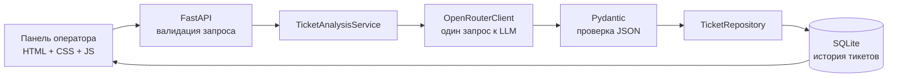
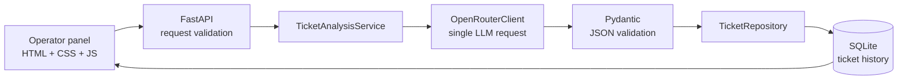

# AI Support Ticket Analyzer

<p align="center">
  LLM-powered internal support tool for structured ticket analysis.<br>
  Внутренняя панель поддержки для структурированного анализа обращений с помощью LLM.
</p>

<p align="center">
  <a href="LICENSE"></a>
  
  
  
  
  
  
  
  
</p>

<p align="center">
  <a href="#русский">Русский</a> | <a href="#english">English</a>
</p>

## Русский

### TL;DR

- AI Support Ticket Analyzer превращает текст обращения в категорию, приоритет, краткое резюме и готовый черновик ответа.
- Backend построен на FastAPI, OpenRouter и Pydantic; история хранится в SQLite без ORM.
- Неудачный анализ не записывается в базу, JSON модели проходит строгую валидацию, а API-ключ остаётся только на backend.
- Проект включает адаптивную панель оператора, 38 изолированных тестов и Docker-запуск с постоянным volume.

### О проекте

AI Support Ticket Analyzer помогает оператору быстрее обработать входящее обращение. Пользователь вставляет текст клиента, запускает анализ и получает:

- категорию обращения;
- приоритет;
- краткое резюме;
- вежливый черновик ответа клиенту.

Успешные результаты сохраняются в SQLite и доступны в истории. Записи можно раскрывать, копировать из них рекомендуемый ответ и удалять прямо из интерфейса.

Проект показывает полный путь небольшой AI-функции: от промпта и строгой проверки ответа модели до API, хранения данных, интерфейса оператора, автотестов и Docker-запуска.

### Возможности

- Структурированный анализ обращений через OpenRouter Chat Completions API.
- Девять допустимых категорий и четыре уровня приоритета.
- Pydantic-валидация входного текста и JSON-ответа модели.
- Очистка Markdown-блока с пометкой `json`, если модель нарушила формат ответа.
- Сохранение только успешно проанализированных обращений.
- История последних тикетов с просмотром деталей и удалением.
- Светлый адаптивный интерфейс на HTML, CSS и vanilla JavaScript.
- Состояния загрузки, сообщения об ошибках и защита от повторной отправки.
- SQLite без ORM и параметризованные SQL-запросы.
- Единый формат ошибок API без раскрытия внутренних деталей.
- Docker-контейнер от непривилегированного пользователя и постоянный volume для базы.
- Изолированные тесты с временной SQLite-базой и замоканным LLM.

### Как это работает



1. FastAPI принимает текст длиной от 5 до 5000 символов.
2. `TicketAnalysisService` передаёт его клиенту OpenRouter.
3. Модель возвращает JSON с категорией, приоритетом, резюме и ответом.
4. Ответ очищается от возможной Markdown-обёртки и проверяется через Pydantic.
5. Только после успешной валидации результат записывается в SQLite.
6. При таймауте, ошибке OpenRouter или невалидном JSON API отвечает `503`, а запись не создаётся.

Пример результата:

```json
{
  "id": 42,
  "original_text": "После смены пароля не могу войти в личный кабинет.",
  "category": "Доступ к аккаунту",
  "priority": "Средний",
  "summary": "Клиент не может войти в аккаунт после смены пароля.",
  "suggested_reply": "Здравствуйте! Пожалуйста, проверьте правильность введённых данных и попробуйте восстановить пароль. Если проблема сохранится, сообщите нам текст ошибки.",
  "created_at": "2026-07-12T10:30:00+00:00"
}
```

### Технологии

| Область | Стек |
|---|---|
| Backend | Python 3.11+, FastAPI, Uvicorn |
| AI | OpenRouter API, прямой HTTP-вызов через HTTPX |
| Validation | Pydantic |
| Database | SQLite, стандартный модуль `sqlite3` |
| Frontend | HTML5, CSS3, vanilla JavaScript |
| Tests | Pytest, FastAPI TestClient, временные SQLite-базы |
| Infrastructure | Docker, Docker Compose |

### Быстрый запуск через Docker

Понадобятся Git, Docker с Docker Compose и API-ключ OpenRouter.

```bash
git clone https://github.com/akiamuradev/ai-support-ticket-analyzer.git
cd ai-support-ticket-analyzer
cp .env.example .env
```

Для PowerShell:

```powershell
Copy-Item .env.example .env
```

Укажите ключ и при необходимости измените модель в `.env`:

```env
OPENROUTER_API_KEY=your-openrouter-api-key
OPENROUTER_MODEL=openai/gpt-4o-mini
```

Запустите приложение:

```bash
docker compose up --build
```

После запуска доступны:

| Адрес | Назначение |
|---|---|
| [http://127.0.0.1:8000](http://127.0.0.1:8000) | Панель оператора |
| [http://127.0.0.1:8000/docs](http://127.0.0.1:8000/docs) | Swagger UI |
| [http://127.0.0.1:8000/health](http://127.0.0.1:8000/health) | Healthcheck |

SQLite-база хранится в Docker volume `ticket_data` и сохраняется после перезапуска контейнера.

```bash
# Остановить контейнер, сохранив историю
docker compose down

# Удалить контейнер вместе с сохранённой базой
docker compose down -v
```

### Локальный запуск

Linux и macOS:

```bash
python3 -m venv .venv
source .venv/bin/activate
pip install -r requirements.txt
cp .env.example .env
uvicorn app.main:app --reload
```

Windows PowerShell:

```powershell
python -m venv .venv
.\.venv\Scripts\Activate.ps1
pip install -r requirements.txt
Copy-Item .env.example .env
uvicorn app.main:app --reload
```

Перед запуском заполните `OPENROUTER_API_KEY` в локальном `.env`. Файл `.env` исключён из Git.

### Переменные окружения

| Переменная | Значение по умолчанию | Назначение |
|---|---|---|
| `APP_ENV` | `development` | Окружение приложения |
| `APP_URL` | `http://127.0.0.1:8000` | URL приложения для заголовка OpenRouter |
| `OPENROUTER_API_KEY` | — | Секретный API-ключ OpenRouter |
| `OPENROUTER_MODEL` | `openai/gpt-4o-mini` | Модель для анализа тикетов |
| `OPENROUTER_BASE_URL` | `https://openrouter.ai/api/v1` | Базовый URL OpenRouter API |
| `LLM_TIMEOUT_SECONDS` | `30` | Таймаут одного запроса к модели |
| `DATABASE_URL` | `sqlite:///./support_tickets.db` | Путь к SQLite-базе |

Все переменные без секретов перечислены в [.env.example](.env.example). Реальный ключ нельзя добавлять во frontend или Git.

### API

| Метод | Endpoint | Назначение |
|---|---|---|
| `GET` | `/` | Интерфейс оператора |
| `GET` | `/health` | Состояние приложения |
| `POST` | `/api/tickets/analyze` | Анализ и сохранение обращения |
| `GET` | `/api/tickets?limit=20` | Последние обращения, сначала новые |
| `GET` | `/api/tickets/{ticket_id}` | Получение одного обращения |
| `DELETE` | `/api/tickets/{ticket_id}` | Удаление обращения |

Параметр `limit` принимает значения от `1` до `100`, по умолчанию используется `20`.

Пример запроса:

```bash
curl -X POST http://127.0.0.1:8000/api/tickets/analyze \
  -H "Content-Type: application/json" \
  -d '{"text":"После оплаты заказ не появился в личном кабинете."}'
```

Ошибки возвращаются в едином формате:

```json
{
  "error": "LLM service unavailable"
}
```

Для ошибок валидации ответ также содержит поле `details`.

### Структура проекта

```text
ai-support-ticket-analyzer/
├── app/
│   ├── main.py          # FastAPI, маршруты и обработчики ошибок
│   ├── config.py        # настройки и загрузка .env
│   ├── schemas.py       # Pydantic-модели
│   ├── database.py      # создание и обновление схемы SQLite
│   ├── repository.py    # параметризованные SQL-запросы
│   ├── services.py      # прикладная логика анализа
│   ├── llm.py           # клиент OpenRouter и разбор ответа
│   └── prompts.py       # системный промпт
├── static/
│   ├── index.html       # интерфейс оператора
│   ├── app.js           # работа с API и состояниями UI
│   └── styles.css       # адаптивное оформление
├── tests/
│   └── test_api.py      # API, SQLite и LLM-тесты
├── Dockerfile
├── docker-compose.yml
├── requirements.txt
└── README.md
```

### Тесты

```bash
python -m pytest -q
```

Тесты не обращаются к интернету и не используют рабочую базу. Для каждого сценария применяется замоканный LLM-клиент и временная SQLite-база.

Покрыты healthcheck, главная страница, static-файлы, анализ, SQLite CRUD, граничные значения, ошибки OpenRouter, невалидный JSON, допустимые категории и приоритеты, защита API-ключа в логах и сохранение истории между перезапусками.

### Надёжность и ограничения

- API-ключ используется только на backend и не передаётся браузеру.
- SQL-запросы параметризованы, а внутренние ошибки не раскрываются клиенту.
- У OpenRouter-запроса есть таймаут и нет автоматических повторных попыток.
- JSON модели проверяется по строгой схеме; неудачные анализы не сохраняются.
- SQLite подходит для небольшого внутреннего инструмента, но не рассчитан на высокую конкурентную нагрузку.
- Аутентификация операторов, разграничение доступа и фоновая очередь не входят в MVP.

## English

### TL;DR

- AI Support Ticket Analyzer turns a customer message into a category, priority, concise summary and ready-to-edit reply draft.
- The backend uses FastAPI, OpenRouter and Pydantic; ticket history is stored in SQLite without an ORM.
- Failed analyses are never persisted, model JSON is strictly validated, and the API key remains on the backend.
- The repository includes a responsive operator panel, 38 isolated tests and a Docker setup with persistent storage.

### About

AI Support Ticket Analyzer is a small internal business tool for support teams. An operator pastes a customer message, starts the analysis and receives a structured result that can be reviewed before replying.

Successful results are stored in SQLite and displayed in a recent-ticket history. Operators can expand saved tickets, copy the suggested reply and delete records from the interface.

The project demonstrates the complete lifecycle of a focused AI feature: prompt design, provider integration, strict output validation, application services, persistence, API design, frontend states, automated tests and containerized delivery.

### Features

- Structured ticket analysis through the OpenRouter Chat Completions API.
- Nine allowed categories and four priority levels.
- Pydantic validation for user input and model output.
- Cleanup of accidental Markdown JSON fences returned by the model.
- Persistence only after a successful and valid analysis.
- Expandable recent-ticket history with record deletion.
- Responsive light interface built with semantic HTML, CSS and vanilla JavaScript.
- Loading, error and duplicate-submission states.
- SQLite persistence without an ORM and parameterized SQL queries.
- Consistent API errors without leaking internal details.
- Non-root Docker container and a persistent database volume.
- Isolated tests using a mocked LLM client and temporary SQLite databases.

### Architecture



The service sends one OpenRouter request per analysis. The response is stripped of an optional Markdown fence, decoded as JSON and validated against a strict Pydantic model. Only a valid analysis reaches the repository. Provider failures, timeouts and invalid model responses return HTTP `503` without creating a database record.

### Tech stack

| Area | Technologies |
|---|---|
| Backend | Python 3.11+, FastAPI, Uvicorn |
| AI | OpenRouter API, direct HTTPX integration |
| Validation | Pydantic |
| Database | SQLite, standard-library `sqlite3` |
| Frontend | HTML5, CSS3, vanilla JavaScript |
| Tests | Pytest, FastAPI TestClient, temporary SQLite databases |
| Infrastructure | Docker, Docker Compose |

### Quick start with Docker

Requirements: Git, Docker with Docker Compose, and an OpenRouter API key.

```bash
git clone https://github.com/akiamuradev/ai-support-ticket-analyzer.git
cd ai-support-ticket-analyzer
cp .env.example .env
```

Set the key in `.env`:

```env
OPENROUTER_API_KEY=your-openrouter-api-key
OPENROUTER_MODEL=openai/gpt-4o-mini
```

Start the application:

```bash
docker compose up --build
```

Open the [operator panel](http://127.0.0.1:8000), [Swagger UI](http://127.0.0.1:8000/docs) or [health endpoint](http://127.0.0.1:8000/health).

The SQLite database is stored in the `ticket_data` Docker volume and survives container restarts. Use `docker compose down` to stop the application or `docker compose down -v` to remove it together with the stored database.

### Local development

```bash
python3 -m venv .venv
source .venv/bin/activate
pip install -r requirements.txt
cp .env.example .env
uvicorn app.main:app --reload
```

On Windows PowerShell, activate the environment with `.\.venv\Scripts\Activate.ps1` and create `.env` with `Copy-Item .env.example .env`.

### API

| Method | Endpoint | Purpose |
|---|---|---|
| `GET` | `/` | Operator interface |
| `GET` | `/health` | Application health |
| `POST` | `/api/tickets/analyze` | Analyze and save a ticket |
| `GET` | `/api/tickets?limit=20` | List newest tickets first |
| `GET` | `/api/tickets/{ticket_id}` | Retrieve one ticket |
| `DELETE` | `/api/tickets/{ticket_id}` | Delete one ticket |

The `limit` query parameter accepts values from `1` to `100` and defaults to `20`.

### Tests

```bash
python -m pytest -q
```

The 38 tests do not access the internet or the production database. They use a mocked LLM client and temporary SQLite databases to cover the web UI, API, persistence, validation, provider errors, Markdown-wrapped JSON, secret-safe logging and restart persistence.

### Reliability and limitations

- The OpenRouter key is backend-only and excluded from Git.
- SQL queries are parameterized and internal failures are hidden from API clients.
- Model output is strictly validated; failed analyses are not stored.
- SQLite is appropriate for a small internal tool, not high-concurrency workloads.
- Operator authentication, role-based access and background processing are outside the current MVP.

## License

This project is distributed under the [MIT License](LICENSE).
